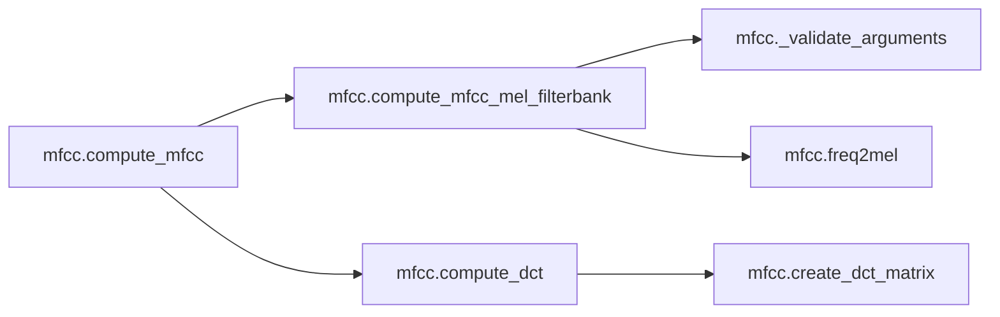
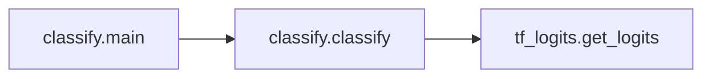
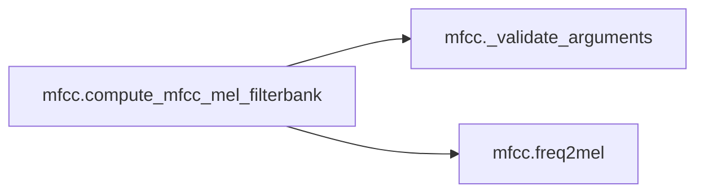
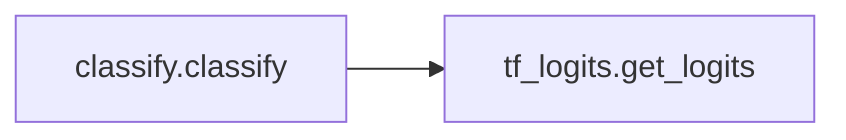
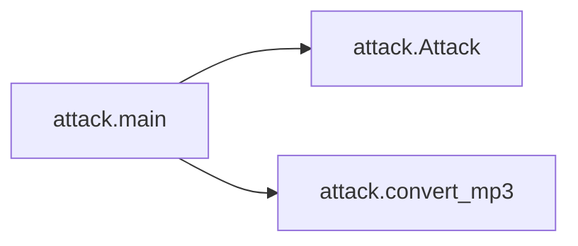
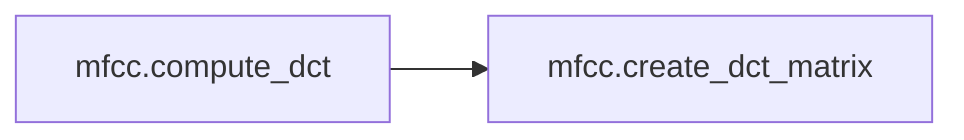

# Key Objects

[_Documentation generated by Documatic_](https://www.documatic.com)

<!---Documatic-section-mfcc.compute_mfcc-start--->
## mfcc.compute_mfcc

<!---Documatic-section-compute_mfcc-start--->


### Object Calls

* mfcc.compute_mfcc_mel_filterbank
* mfcc.compute_dct

<!---Documatic-block-mfcc.compute_mfcc-start--->
<details>
	<summary><code>mfcc.compute_mfcc</code> code snippet</summary>

```python
def compute_mfcc(spectrogram, sample_rate, lower_edge_hertz=20, upper_edge_hertz=4000, filterbank_channel_count=40, dct_coefficient_count=13, dtype=tf.float32):
    vals = compute_mfcc_mel_filterbank(spectrogram, sample_rate, lower_edge_hertz, upper_edge_hertz, filterbank_channel_count)
    kFilterbankFloor = 1e-12
    vals = vals * tf.cast(vals > 0, dtype) + kFilterbankFloor
    log_mel_energies = tf.math.log(vals)
    return compute_dct(log_mel_energies, dct_coefficient_count)
```
</details>
<!---Documatic-block-mfcc.compute_mfcc-end--->
<!---Documatic-section-compute_mfcc-end--->

# #
<!---Documatic-section-mfcc.compute_mfcc-end--->

<!---Documatic-section-mfcc._validate_arguments-start--->
## mfcc._validate_arguments

<!---Documatic-section-_validate_arguments-start--->
<!---Documatic-block-mfcc._validate_arguments-start--->
<details>
	<summary><code>mfcc._validate_arguments</code> code snippet</summary>

```python
def _validate_arguments(filterbank_channel_count, sample_rate, lower_edge_hertz, upper_edge_hertz, dtype):
    if filterbank_channel_count <= 0:
        raise ValueError('filterbank_channel_count must be positive. Got: %s' % filterbank_channel_count)
    if sample_rate <= 0.0:
        raise ValueError('sample_rate must be positive. Got: %s' % sample_rate)
    if lower_edge_hertz < 0.0:
        raise ValueError('lower_edge_hertz must be non-negative. Got: %s' % lower_edge_hertz)
    if lower_edge_hertz >= upper_edge_hertz:
        raise ValueError('lower_edge_hertz %.1f >= upper_edge_hertz %.1f' % (lower_edge_hertz, upper_edge_hertz))
    if upper_edge_hertz > sample_rate / 2:
        raise ValueError('upper_edge_hertz must not be larger than the Nyquist frequency (sample_rate / 2). Got: %s for sample_rate: %s' % (upper_edge_hertz, sample_rate))
    if not dtype.is_floating:
        raise ValueError('dtype must be a floating point type. Got: %s' % dtype)
```
</details>
<!---Documatic-block-mfcc._validate_arguments-end--->
<!---Documatic-section-_validate_arguments-end--->

# #
<!---Documatic-section-mfcc._validate_arguments-end--->

<!---Documatic-section-classify.main-start--->
## classify.main

<!---Documatic-section-main-start--->


### Object Calls

* classify.classify

<!---Documatic-block-classify.main-start--->
<details>
	<summary><code>classify.main</code> code snippet</summary>

```python
def main(_):
    initialize_globals()
    classify()
```
</details>
<!---Documatic-block-classify.main-end--->
<!---Documatic-section-main-end--->

# #
<!---Documatic-section-classify.main-end--->

<!---Documatic-section-attack.run_script-start--->
## attack.run_script

<!---Documatic-section-run_script-start--->
<!---Documatic-block-attack.run_script-start--->
<details>
	<summary><code>attack.run_script</code> code snippet</summary>

```python
def run_script():
    create_flags()
    absl.app.run(main)
```
</details>
<!---Documatic-block-attack.run_script-end--->
<!---Documatic-section-run_script-end--->

# #
<!---Documatic-section-attack.run_script-end--->

<!---Documatic-section-mfcc.compute_mfcc_mel_filterbank-start--->
## mfcc.compute_mfcc_mel_filterbank

<!---Documatic-section-compute_mfcc_mel_filterbank-start--->


### Object Calls

* mfcc._validate_arguments
* mfcc.freq2mel

<!---Documatic-block-mfcc.compute_mfcc_mel_filterbank-start--->
<details>
	<summary><code>mfcc.compute_mfcc_mel_filterbank</code> code snippet</summary>

```python
def compute_mfcc_mel_filterbank(spectrogram, sample_rate=16000, lower_edge_hertz=20.0, upper_edge_hertz=8000.0, filterbank_channel_count=40, dtype=tf.float32, name=None):
    _validate_arguments(filterbank_channel_count, sample_rate, lower_edge_hertz, upper_edge_hertz, dtype)
    input_length = spectrogram.shape[-1].value
    batch_size = spectrogram.shape[0].value
    center_freqs = np.zeros((filterbank_channel_count + 1,))
    mel_low = freq2mel(lower_edge_hertz)
    mel_high = freq2mel(upper_edge_hertz)
    mel_span = mel_high - mel_low
    mel_spacing = mel_span / (filterbank_channel_count + 1)
    for i in range(filterbank_channel_count + 1):
        center_freqs[i] = mel_low + mel_spacing * (i + 1)
    hz_per_sbin = 0.5 * sample_rate / (input_length - 1)
    start_index = int(1.5 + lower_edge_hertz / hz_per_sbin)
    end_index = int(upper_edge_hertz / hz_per_sbin)
    band_mapper = np.zeros((input_length,))
    channel = 0
    for i in range(input_length):
        melf = freq2mel(i * hz_per_sbin)
        if i < start_index or i > end_index:
            band_mapper[i] = -2
        else:
            while channel < filterbank_channel_count and center_freqs[channel] < melf:
                channel += 1
            band_mapper[i] = channel - 1
    weights = np.zeros((input_length,))
    for i in range(input_length):
        channel = band_mapper[i]
        if i < start_index or i > end_index:
            weights[i] = 0.0
        else:
            channel = int(channel)
            if channel >= 0:
                weights[i] = (center_freqs[channel + 1] - freq2mel(i * hz_per_sbin)) / (center_freqs[channel + 1] - center_freqs[channel])
            else:
                weights[i] = (center_freqs[0] - freq2mel(i * hz_per_sbin)) / (center_freqs[0] - mel_low)
    bad_channels = []
    for c in range(filterbank_channel_count):
        band_weight_sum = 0.0
        for i in range(input_length):
            if band_mapper[i] == c - 1:
                band_weight_sum += 1.0 - weights[i]
            elif band_mapper[i] == c:
                band_weight_sum += weights[i]
        if band_weight_sum < 0.5:
            bad_channels.append(c)
    mapping_matrix_w = np.zeros((filterbank_channel_count, input_length))
    mapping_matrix_r = np.zeros((filterbank_channel_count, input_length))
    for i in range(start_index, end_index):
        channel = int(band_mapper[i])
        if channel >= 0:
            mapping_matrix_w[channel][i] = 1.0
        channel += 1
        if channel < filterbank_channel_count:
            mapping_matrix_r[channel][i] = 1.0
    mapping_matrix_w = np.stack([mapping_matrix_w] * batch_size, axis=0)
    mapping_matrix_r = np.stack([mapping_matrix_r] * batch_size, axis=0)
    weights = np.stack([np.stack([weights] * batch_size, axis=0)] * spectrogram.shape[1], axis=1)
    spec_val = tf.math.sqrt(spectrogram)
    weighted = tf.math.multiply(spec_val, weights)
    res = spec_val - weighted
    weighted = tf.transpose(weighted, perm=[0, 2, 1])
    res = tf.transpose(res, perm=[0, 2, 1])
    return tf.matmul(tf.cast(mapping_matrix_w, dtype), weighted) + tf.matmul(tf.cast(mapping_matrix_r, dtype), res)
```
</details>
<!---Documatic-block-mfcc.compute_mfcc_mel_filterbank-end--->
<!---Documatic-section-compute_mfcc_mel_filterbank-end--->

# #
<!---Documatic-section-mfcc.compute_mfcc_mel_filterbank-end--->

<!---Documatic-section-mfcc.freq2mel-start--->
## mfcc.freq2mel

<!---Documatic-section-freq2mel-start--->
<!---Documatic-block-mfcc.freq2mel-start--->
<details>
	<summary><code>mfcc.freq2mel</code> code snippet</summary>

```python
def freq2mel(frequencies_hertz):
    return _MEL_HIGH_FREQUENCY_Q * np.log1p(frequencies_hertz / _MEL_BREAK_FREQUENCY_HERTZ)
```
</details>
<!---Documatic-block-mfcc.freq2mel-end--->
<!---Documatic-section-freq2mel-end--->

# #
<!---Documatic-section-mfcc.freq2mel-end--->

<!---Documatic-section-classify.classify-start--->
## classify.classify

<!---Documatic-section-classify-start--->


### Object Calls

* tf_logits.get_logits

<!---Documatic-block-classify.classify-start--->
<details>
	<summary><code>classify.classify</code> code snippet</summary>

```python
def classify():
    with tf.Session() as sess:
        if FLAGS.input.split('.')[-1] == 'mp3':
            raw = pydub.AudioSegment.from_mp3(FLAGS.input)
            audio = np.array([struct.unpack('<h', raw.raw_data[i:i + 2])[0] for i in range(0, len(raw.raw_data), 2)])
        elif FLAGS.input.split('.')[-1] == 'wav':
            (_, audio) = wav.read(FLAGS.input)
            if audio.shape[-1] == 2:
                audio = np.squeeze(audio[:, 1])
                print(audio.shape)
        else:
            raise Exception('Unknown file format')
        N = audio.shape[0]
        new_input = tf.placeholder(tf.float32, [1, N])
        lengths = tf.placeholder(tf.int32, [1])
        with tf.variable_scope('', reuse=tf.AUTO_REUSE):
            logits = get_logits(new_input, lengths)
        saver = tf.train.Saver()
        saver.restore(sess, FLAGS.restore_path)
        probs = tf.nn.softmax(logits, name='logits')
        probs = tf.squeeze(probs)
        length = (N - 2 * Config.audio_step_samples / 3) // 320
        r = sess.run(probs, {new_input: [audio], lengths: [length]})
        if FLAGS.scorer_path:
            scorer = Scorer(FLAGS.lm_alpha, FLAGS.lm_beta, FLAGS.scorer_path, Config.alphabet)
        else:
            scorer = None
        decoded = ctc_beam_search_decoder(r, Config.alphabet, FLAGS.beam_width, scorer=scorer, cutoff_prob=FLAGS.cutoff_prob, cutoff_top_n=FLAGS.cutoff_top_n)
        print('-' * 80)
        print('-' * 80)
        print('Classification:')
        print(decoded[0][1])
        print('-' * 80)
        print('-' * 80)
        data_dict = {'name': [FLAGS.input], 'transcript': [decoded[0][1]]}
        df = pd.DataFrame(data_dict, columns=['name', 'transcript'])
        csv_filename = 'tmp/classify-{}.csv'.format(time.strftime('%Y%m%d-%H%M%S'))
        df.to_csv(csv_filename, index=False, header=True)
```
</details>
<!---Documatic-block-classify.classify-end--->
<!---Documatic-section-classify-end--->

# #
<!---Documatic-section-classify.classify-end--->

<!---Documatic-section-tf_logits.periodic_hann_window-start--->
## tf_logits.periodic_hann_window

<!---Documatic-section-periodic_hann_window-start--->
<!---Documatic-block-tf_logits.periodic_hann_window-start--->
<details>
	<summary><code>tf_logits.periodic_hann_window</code> code snippet</summary>

```python
def periodic_hann_window(window_length, dtype):
    return 0.5 - 0.5 * tf.math.cos(2.0 * np.pi * tf.range(tf.to_float(window_length), dtype=dtype) / tf.to_float(window_length))
```
</details>
<!---Documatic-block-tf_logits.periodic_hann_window-end--->
<!---Documatic-section-periodic_hann_window-end--->

# #
<!---Documatic-section-tf_logits.periodic_hann_window-end--->

<!---Documatic-section-classify.run_script-start--->
## classify.run_script

<!---Documatic-section-run_script-start--->
<!---Documatic-block-classify.run_script-start--->
<details>
	<summary><code>classify.run_script</code> code snippet</summary>

```python
def run_script():
    create_flags()
    absl.app.run(main)
```
</details>
<!---Documatic-block-classify.run_script-end--->
<!---Documatic-section-run_script-end--->

# #
<!---Documatic-section-classify.run_script-end--->

<!---Documatic-section-attack.main-start--->
## attack.main

<!---Documatic-section-main-start--->


### Object Calls

* attack.Attack
* attack.convert_mp3

<!---Documatic-block-attack.main-start--->
<details>
	<summary><code>attack.main</code> code snippet</summary>

```python
def main(_):
    initialize_globals()
    toks = " abcdefghijklmnopqrstuvwxyz'-"
    with tf.Session() as sess:
        finetune = []
        audios = []
        lengths = []
        names = []
        source_dBs = []
        distortions = []
        high_pertub_bounds = []
        low_pertub_bounds = []
        if FLAGS.output is None:
            assert FLAGS.outprefix is not None
        else:
            assert FLAGS.outprefix is None
            assert len(FLAGS.input) == len(FLAGS.output)
        if FLAGS.finetune is not None and len(FLAGS.finetune):
            assert len(FLAGS.input) == len(FLAGS.finetune)
        for i in range(len(FLAGS.input)):
            (fs, audio) = wav.read(FLAGS.input[i])
            names.append(FLAGS.input[i])
            assert fs == 16000
            assert audio.dtype == np.int16
            if audio.shape[-1] == 2:
                audio = np.squeeze(audio[:, 1])
                print(audio.shape)
            source_dB = 20 * np.log10(np.max(np.abs(audio)))
            print('source dB', source_dB)
            source_dBs.append(source_dB)
            audios.append(list(audio))
            lengths.append(len(audio))
            if FLAGS.finetune is not None:
                finetune.append(list(wav.read(FLAGS.finetune[i])[1]))
        maxlen = max(map(len, audios))
        audios = np.array([x + [0] * (maxlen - len(x)) for x in audios])
        finetune = np.array([x + [0] * (maxlen - len(x)) for x in finetune])
        phrase = FLAGS.target
        print('\nAttack phrase: ', phrase)
        attack = Attack(sess, 'CTC', len(phrase), maxlen, batch_size=len(audios), mp3=FLAGS.mp3, learning_rate=FLAGS.lr, num_iterations=FLAGS.iterations, l2penalty=FLAGS.l2penalty, restore_path=FLAGS.restore_path)
        start_time = time.time()
        (deltas, first_hits, best_hits) = attack.attack(audios, lengths, [[toks.index(x) for x in phrase]] * len(audios), toks, finetune)
        runtime = time.time() - start_time
        print('Finished in {}s.'.format(runtime))
        if FLAGS.mp3:
            convert_mp3(deltas, lengths)
            copyfile('/tmp/saved.mp3', FLAGS.output[0])
            print('Final distortion', np.max(np.abs(deltas[0][:lengths[0]] - audios[0][:lengths[0]])))
        else:
            for i in range(len(FLAGS.input)):
                if FLAGS.output is not None:
                    path = FLAGS.output[i]
                else:
                    path = FLAGS.outprefix + str(i) + '.wav'
                wav.write(path, 16000, np.array(np.clip(np.round(deltas[i][:lengths[i]]), -2 ** 15, 2 ** 15 - 1), dtype=np.int16))
                diff = deltas[i][:lengths[i]] - audios[i][:lengths[i]]
                high_pertub_bound = np.max(np.abs(diff))
                low_pertub_bound = np.min(np.abs(diff[diff != 0]))
                distortion = 20 * np.log10(np.max(np.abs(diff))) - source_dBs[i]
                high_pertub_bounds.append(high_pertub_bound)
                low_pertub_bounds.append(low_pertub_bound)
                distortions.append(distortion)
                print('Final noise loudness: ', distortion)
    data_dict = {'filename': names, 'length': lengths, 'attack_runtime': [runtime] * len(names), 'source_dB': source_dBs, 'noise_loudness': distortions, 'high_pertubation_bound': high_pertub_bounds, 'low_pertubation_bound': low_pertub_bounds, 'first_hit': first_hits, 'best_hit': best_hits}
    df = pd.DataFrame(data_dict, columns=['filename', 'length', 'attack_runtime', 'source_dB', 'noise_loudness', 'high_pertubation_bound', 'low_pertubation_bound', 'first_hit', 'best_hit'])
    csv_filename = 'tmp/attack-{}.csv'.format(FLAGS.lang, time.strftime('%Y%m%d-%H%M%S'))
    df.to_csv(csv_filename, index=False, header=True)
```
</details>
<!---Documatic-block-attack.main-end--->
<!---Documatic-section-main-end--->

# #
<!---Documatic-section-attack.main-end--->

<!---Documatic-section-mfcc.create_dct_matrix-start--->
## mfcc.create_dct_matrix

<!---Documatic-section-create_dct_matrix-start--->
<!---Documatic-block-mfcc.create_dct_matrix-start--->
<details>
	<summary><code>mfcc.create_dct_matrix</code> code snippet</summary>

```python
def create_dct_matrix(dct_coefficient_count=13, filterbank_channel_count=40, dtype=tf.float32):
    fnorm = np.sqrt(2 / filterbank_channel_count)
    arg = np.pi / filterbank_channel_count
    arg_ = np.zeros((dct_coefficient_count, filterbank_channel_count))
    for i in range(dct_coefficient_count):
        for j in range(filterbank_channel_count):
            arg_[i][j] = i * arg * (j + 0.5)
    return fnorm * np.cos(arg_)
```
</details>
<!---Documatic-block-mfcc.create_dct_matrix-end--->
<!---Documatic-section-create_dct_matrix-end--->

# #
<!---Documatic-section-mfcc.create_dct_matrix-end--->

<!---Documatic-section-attack.convert_mp3-start--->
## attack.convert_mp3

<!---Documatic-section-convert_mp3-start--->
<!---Documatic-block-attack.convert_mp3-start--->
<details>
	<summary><code>attack.convert_mp3</code> code snippet</summary>

```python
def convert_mp3(new, lengths):
    import pydub
    wav.write('/tmp/load.wav', 16000, np.array(np.clip(np.round(new[0][:lengths[0]]), -2 ** 15, 2 ** 15 - 1), dtype=np.int16))
    pydub.AudioSegment.from_wav('/tmp/load.wav').export('/tmp/saved.mp3')
    raw = pydub.AudioSegment.from_mp3('/tmp/saved.mp3')
    mp3ed = np.array([struct.unpack('<h', raw.raw_data[i:i + 2])[0] for i in range(0, len(raw.raw_data), 2)])[np.newaxis, :lengths[0]]
    return mp3ed
```
</details>
<!---Documatic-block-attack.convert_mp3-end--->
<!---Documatic-section-convert_mp3-end--->

# #
<!---Documatic-section-attack.convert_mp3-end--->

<!---Documatic-section-tf_logits.get_logits-start--->
## tf_logits.get_logits

<!---Documatic-section-get_logits-start--->
<!---Documatic-block-tf_logits.get_logits-start--->
<details>
	<summary><code>tf_logits.get_logits</code> code snippet</summary>

```python
def get_logits(audio, length):
    audio = tf.cast(audio / 2 ** 15, tf.float32)
    stfts = tf.signal.stft(audio, frame_length=512, frame_step=320, fft_length=512, window_fn=periodic_hann_window)
    spectrogram = tf.square(tf.abs(stfts))
    features = mfcc.compute_mfcc(spectrogram=spectrogram, sample_rate=FLAGS.audio_sample_rate, upper_edge_hertz=FLAGS.audio_sample_rate / 2, dct_coefficient_count=Config.n_input)
    features = create_overlapping_windows(features)
    no_dropout = [None] * 6
    (logits, _) = create_model(features, seq_length=length, dropout=no_dropout, overlap=False)
    return logits
```
</details>
<!---Documatic-block-tf_logits.get_logits-end--->
<!---Documatic-section-get_logits-end--->

# #
<!---Documatic-section-tf_logits.get_logits-end--->

<!---Documatic-section-mfcc.compute_dct-start--->
## mfcc.compute_dct

<!---Documatic-section-compute_dct-start--->


### Object Calls

* mfcc.create_dct_matrix

<!---Documatic-block-mfcc.compute_dct-start--->
<details>
	<summary><code>mfcc.compute_dct</code> code snippet</summary>

```python
def compute_dct(log_mel_energies, dct_coefficient_count=13, filterbank_channel_count=40, dtype=tf.float32):
    batch_size = log_mel_energies.shape[0]
    cosines = create_dct_matrix(dct_coefficient_count, filterbank_channel_count)
    cosines = tf.cast(np.stack([cosines] * batch_size, axis=0), dtype)
    input_length = log_mel_energies.shape[1]
    if input_length > filterbank_channel_count:
        input_length = filterbank_channel_count
    return tf.transpose(tf.matmul(cosines[:, :input_length, :], log_mel_energies), perm=[0, 2, 1])
```
</details>
<!---Documatic-block-mfcc.compute_dct-end--->
<!---Documatic-section-compute_dct-end--->

# #
<!---Documatic-section-mfcc.compute_dct-end--->

[_Documentation generated by Documatic_](https://www.documatic.com)